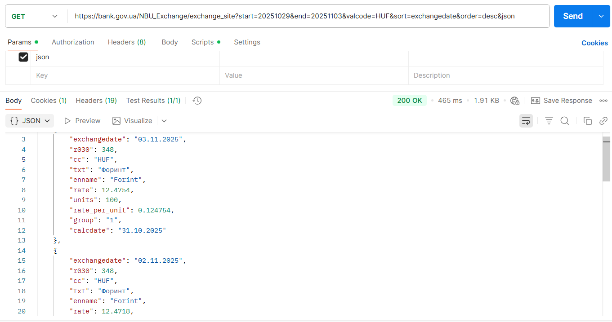
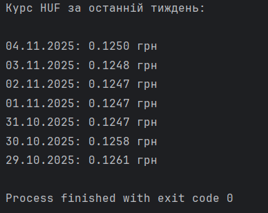
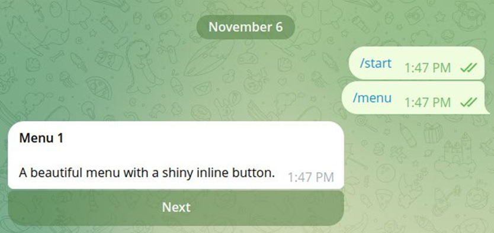

# Звіт з лабораторної роботи №1 студентки гр. КУІБ-22-1 Шматко Софії

# Завдання
1. Отримати курс валют із сайту НБУ за попередній тиждень за допомогою Postman. Приклад використання API

   Для отримання офіційних курсів валют за попередній тиждень було сформовано запит GET  в середовищі Postman із зазначенням дат початку та завершення періоду, коду валюти та формату відповіді JSON. У результаті отримано масив даних з курсами валют вінгерського форинту за попередній тиждень.
      
   

2. Отримати курс валют із сайту НБУ за попередній тиждень з використанням python-бібліотеки requests

   За допомогою мови Python та бібліотеки requests реалізовано програмний код для отримання курсу валют вінгерського форинту із сайту НБУ за попередній тиждень. 
Програмний код для виконання завдання: **[Task2.py](Scripts/Task2.py)**.
   Отримані дані наведено нижче на рисунку:

     
  
3. Побудувати графік зміни курсів валют за допомогою бібліотеки matplotlib

   На основі отриманих даних побудовано графік зміни курсу обраної валюти за тиждень з використанням бібліотеки matplotlib. По осі X відкладено дати, по осі Y - значення курсу. Графік дозволяє наочно проаналізувати динаміку курсу.
   Програмний код для виконання завдання: **[Task3.py](Scripts/Task3.py)**
   

4. За допомогою python та бібліотеки telethon (https://docs.telethon.dev/en/stable/index.html) виконати наступні дії з Telegram: отримати перелік користувачів будь-якого чата/пабліку, відправити повідомлення якомусь контакту напряму або опублікувати повідомлення в чат/паблік.

   З використанням бібліотеки telethon було реалізовано клієнт Telegram, який дозволяє отримати список користувачів із заданого чату або публічного каналу. У процесі виконання було здійснено підключення до Telegram API та виведено основну інформацію про учасників.
   Програмний код для виконання завдання: **[Task4.py](Scripts/Task4.py)**

   Нижче на рисунку результат отриманого переліку користувачів обраного чата/пабліку:
   
   

   Нижче на рисунку результат відправлення повідомлення якомусь контакту напряму та самому собі:
   
   

5. На основі Telegram Bot API та прикладу (https://gitlab.com/Athamaxy/telegram-bot-tutorial/-/blob/main/TutorialBot.py) створити бота, що підтримує команди menu, whisper, scream

   На основі Telegram Bot API та прикладу з репозиторію GitLab було розроблено Telegram-бота, який підтримує команди menu, whisper та scream. Бот реагує на команди користувача та відображає відповідні повідомлення.
Програмний код для виконання завдання: **[Task5.py](Scripts/Task5.py)**

   Нижче на рисунках наведено приклад викоання команд створеним ботом:

   

   

