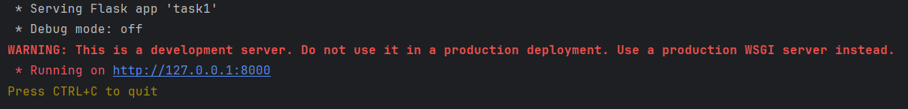
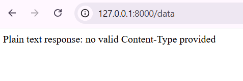
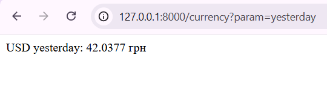
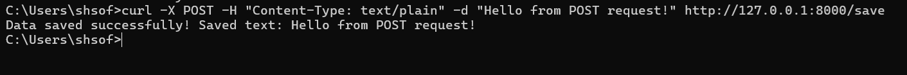

# Звіт з лабораторної роботи №2 студентки гр. КУІБ-22-1 Шматко Софії

# Завдання
1. [Easy] Встановити python веб фреймворк та запустити веб сервер на порту 8000.

   Було встановлено Python вебфреймворк та налаштовано запуск вебсервера на локальному хості з використанням порту 8000. Після запуску сервера перевірено його коректну роботу шляхом відкриття адреси в браузері. Отриманий результат підтверджує успішний запуск сервера.
   Результат виконання:
   
   

   

   Програмний код для виконання завдання: **[Task1.py](Scripts/task1.py)**

2. [Easy] Написати просту обробку запиту метода GET сервером. На запит повертати строку “Hello World!” 

   Реалізовано просту обробку HTTP-запиту методу GET на стороні сервера. При зверненні до сервера у відповідь повертається текстове повідомлення «Hello World», що підтверджує правильну обробку запитів та функціонування маршруту.
   Програмний код для виконання завдання: **[Task2.py](Scripts/task2.py)**

   Результат виконання:

     

     
  
3.	[Easy-Medium] Написати просту обробку запиту метода GET сервером зі шляхом та параметрами в URL, наприклад http://127.0.0.1:8000/currency?today&key=value. Повертати статичне значення курса валют, наприклад “USD - 41,5”.  Для flask отримати параметри запиту за допомогою request.args.get(), для bottle -  request.query()

      Було розроблено серверну обробку GET-запиту зі шляхом та параметрами в URL. Сервер приймає параметри запиту та повертає статичне значення курсу валюти у текстовому форматі. 

      Програмний код для виконання завдання: **[Task3.py](Scripts/Task3.py)**

      Результат виконання:

      

4.	[Medium] Обробка заголовків запиту. В залежності від значення параметру заголовку “Content-Type” (application/json чи application/xml) повертати json чи xml документ. У разі відсутності - повертати звичайний текст. Для flask отримати заголовки за допомогою request.headers.get, для bottle - request.get_header[]. 

      Було реалізовано обробку HTTP-заголовків запиту. Залежно від значення заголовка Content-Type, сервер формує відповідь у форматі JSON або XML. У разі відсутності відповідного заголовка сервер повертає звичайний текст. Таким чином продемонстровано роботу з заголовками HTTP-запитів.
      Програмний код для виконання завдання: **[Task4.py](Scripts/Task4.py)**

      Результат виконання:

       - xml/json
   
      

      - plain text
  
        

5.	[Medium-Hard]  Написати обробку запиту метода GET сервером зі шляхом та параметрами в URL http://127.0.0.1:800/currency?<param>, де допустимі значення param: today, yesterday. Курси валют запитувати динамічно у програмі з офіційного сайту НБУ, згідно API специфікації - https://bank.gov.ua/admin_uploads/article/Instr_API_KURS_VAL_data.pdf

      Реалізовано серверну обробку GET-запитів із параметрами today та yesterday. Сервер динамічно отримує актуальний курс валюти USD з офіційного API НБУ та повертає значення залежно від переданого параметра.
      Результат виконання:

      a.	today - курс USD, актуальний на сьогодні

      

      b.	yesterday -  курс USD, актуальний на попередній день

      

   Програмний код для виконання завдання: **[Task5.py](Scripts/Task5.py)**

6.	[Hard] Написати обробку методу POST веб-сервером. У тілі повідомлення передавати текстові дані. Зберегти ці дані на сервері:

      Розроблено обробку POST-запиту вебсервером. Текстові дані, передані в тілі запиту, зберігаються на сервері у файл. Результат виконання підтверджує коректну роботу методу POST та механізму збереження даних.
      Результат виконання:

      a.	[Easy] у файл

      

      Програмний код для виконання завдання: **[Task6.py](Scripts/Task6.py)**

