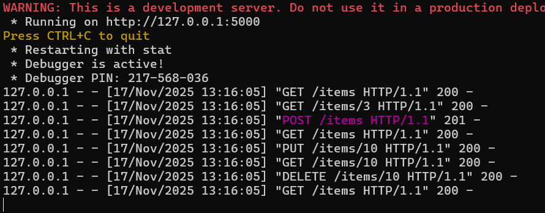

# Звіт з лабораторної роботи №3 студентки гр. КУІБ-22-1 Шматко Софії

# Завдання
Створити веб-сервіс для обробки зберігання даних про каталог товарів у магазині. Кожен товар має бути описаний як мінімум за 3 параметрами, наприклад ідентифікатор товара, ціна, розмір, вага, колір, і т.д. Елементи каталога товарів рекомендується писати англійською у разі збереження каталогу у файл.

1.	Розробити REST API веб-сервісу з використанням будь-якого фреймворку python (flask, bottle, etc.). Веб-сервіс повинен: реалізовувати 2 API endpoints.

      Було розроблено REST API веб-сервіс для зберігання та обробки каталогу товарів магазину з використанням Python-фреймворку (Flask). Кожен товар описується щонайменше трьома параметрами, такими як ідентифікатор, ціна та додаткові характеристики. Для роботи з каталогом реалізовано API-ендпоінт /items, який забезпечує доступ до всіх товарів та дозволяє переглядати вміст каталогу. Дані каталогу зберігаються у файлі у форматі JSON, де назви полів подані англійською мовою. Було реалізовано 2 API endpoints:

      а.	/items - за цим ендпоінтом проводяться операції з усіма товарами в каталозі, наприклад можливо вивести те, що зберігається у каталозі

      Результат виведення усіх товарів:

      

      б.	/items/<id> - інформація про конкретний товар за його атрибутом <id> 
    
      Результат виведення про конктретний товар:
    
      

2. Підтримувати HTTP Basic аутентифікацію. Користувацькі дані (тобто username password) повинні зберігатися:
i.	[Medium] у файлі **[users.txt](users.txt)**

      У веб-сервісі реалізовано HTTP Basic автентифікацію для обмеження доступу до REST API. Облікові дані користувачів (ім’я користувача та пароль) зберігаються у текстовому файлі users.txt. Під час кожного запиту сервер перевіряє коректність переданих даних та надає доступ лише автентифікованим користувачам.

      Програмний код для виконання завдання: **[Server.py](Server.py)**
    
3. Веб-сервіс повинен обробляти 4 HTTP методи під час запиту до REST API.

      Веб-сервіс підтримує обробку чотирьох HTTP-методів під час роботи з REST API. Метод GET використовується для отримання записів каталогу, POST — для додавання нових товарів, PUT — для оновлення наявних записів, DELETE — для видалення товарів з каталогу.
   
      а.	GET для зчитування записів

      

      б. POST для створення записів

      

      Результат виведення товарів з новим товаром
   
      

      в. PUT для оновлення запису

      

      г. DELETE для видалення записів 

      

      Результат виведення товарів після видалення одного товару

      

4. Веб-сервіс повинен обробляти дані (тобто отримувати запити та формувати відповідь) у форматі json

      Сервер отримує запити та формує відповіді у форматі JSON. Клієнтський застосунок, реалізований у файлі Client.py, передає та отримує дані у JSON-форматі.   
      Прогамний код клієнта **[Client.py](Client.py)**

      Прогамний код сервера **[Server.py](Server.py)** 

5. Організувати зберігання каталогу товарів: [Medium] у файлі **[items.json](items.json)** 

      Каталог товарів організовано у вигляді JSON-файлу items.json. У файлі зберігається перелік товарів із основними параметрами, такими як ідентифікатор, назва, ціна та додаткові характеристики.

6. Протестувати функціональність веб-сервісу з використанням бібліотеки requests написати клієнт для веб-сервісу, за допомогою якого можна зчитувати каталог товарів, додавати, оновлювати та видаляти товари з каталогу.

      Функціональність веб-сервісу перевірено за допомогою клієнтської програми з використанням бібліотеки requests. За допомогою клієнта виконано зчитування каталогу товарів, додавання нових записів, оновлення та видалення товарів, що підтверджує коректну роботу REST API.

      Прогамний код клієнта **[Client.py](Client.py)** 

      Прогамний код сервера **[Server.py](Server.py)** 

      Результат перевірки функціональності веб-сервісу : 

      

      Лог роботи веб-сервісу: 

      

