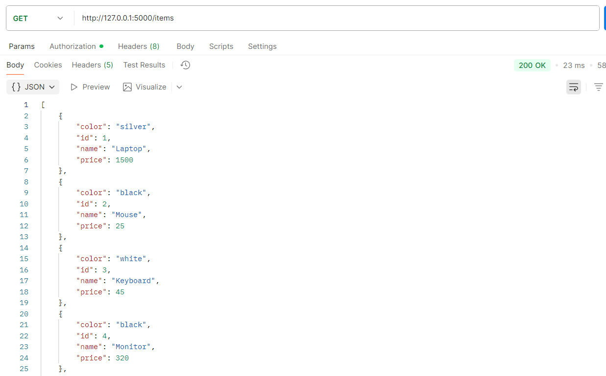
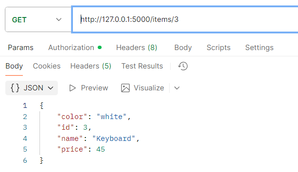
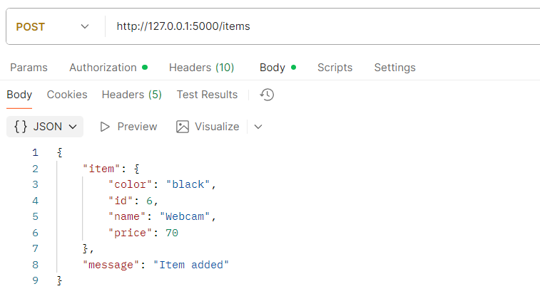
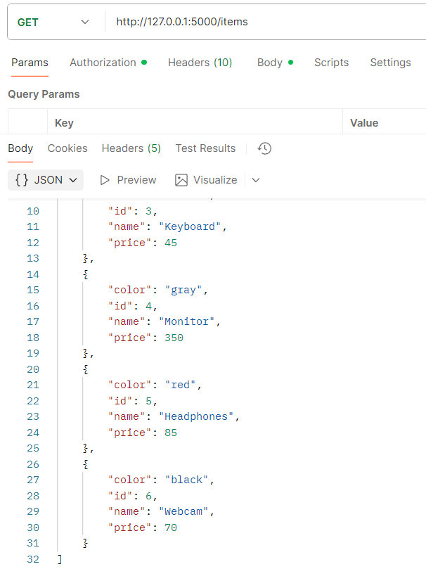
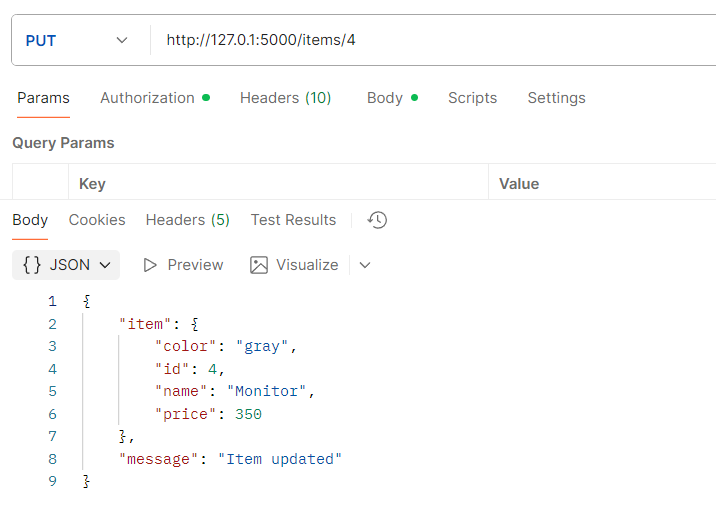
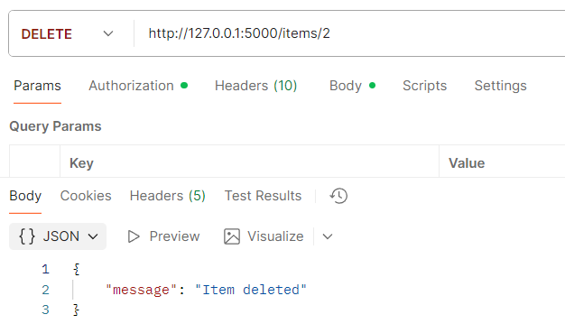
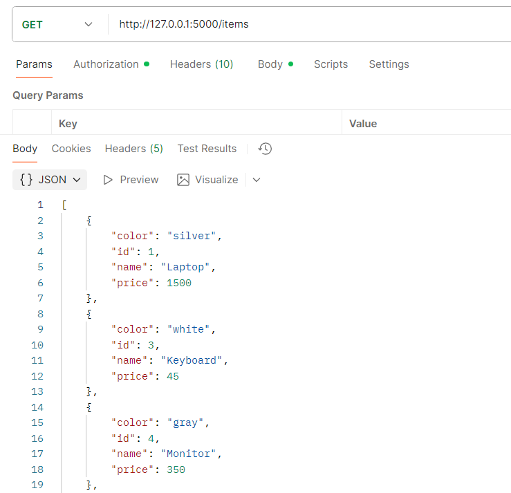
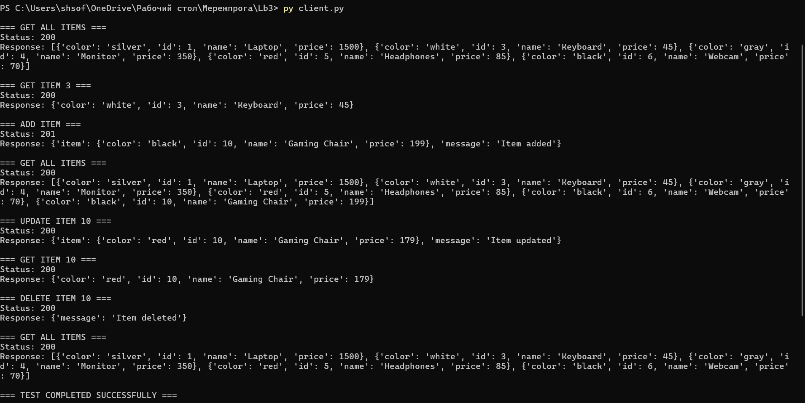

# Звіт з лабораторної роботи №3 студентки гр. КУІБ-22-1 Шматко Софії

# Завдання
Створити веб-сервіс для обробки зберігання даних про каталог товарів у магазині. Кожен товар має бути описаний як мінімум за 3 параметрами, наприклад ідентифікатор товара, ціна, розмір, вага, колір, і т.д. Елементи каталога товарів рекомендується писати англійською у разі збереження каталогу у файл.

1.	Розробити REST API веб-сервісу з використанням будь-якого фреймворку python (flask, bottle, etc.). Веб-сервіс повинен:
   
a.	Реалізовувати 2 API endpoints:

i.	/items - за цим ендпоінтом проводяться операції з усіма товарами в каталозі, наприклад можливо вивести те, що зберігається у каталозі

ii.	/items/<id> - інформація про конкретний товар за його атрибутом <id> 
    

2. Підтримувати HTTP Basic аутентифікацію. Користувацькі дані (тобто username password) повинні зберігатися:
i.	[Medium] у файлі **[users.txt](users.txt)**

Програмний код для виконання завдання: **[Server.py](Server.py)**
    
3 Веб-сервіс повинен обробляти 4 HTTP методи під час запиту до REST API:
i.	GET для зчитування записів

ii.	POST для створення записів

iii.	PUT для оновлення запису

iv.	DELETE для видалення записів 

4. Веб-сервіс повинен обробляти дані (тобто отримувати запити та формувати відповідь) у форматі json
Прогамний код клієнта **[Client.py](Client.py)** 
Прогамний код сервера **[Server.py](Server.py)** 

6. Організувати зберігання каталогу товарів:
ii.	[Medium] у файлі **[items.json](items.json)** 

7. Протестувати функціональність веб-сервісу з використанням бібліотеки requests написати клієнт для веб-сервісу, за допомогою якого можна зчитувати каталог товарів, додавати, оновлювати та видаляти товари з каталогу 

Прогамний код клієнта **[Client.py](Client.py)** 
Прогамний код сервера **[Server.py](Server.py)** 

Результат роботи: 
 

