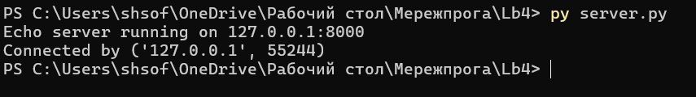
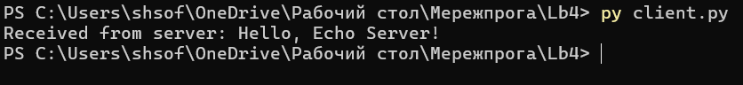
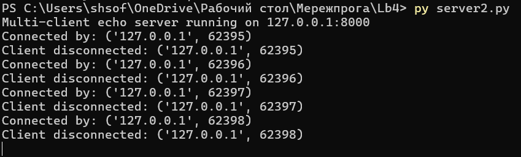
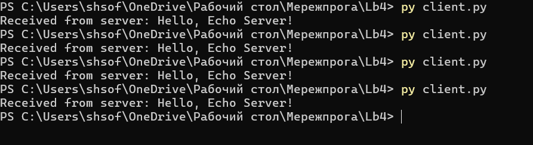
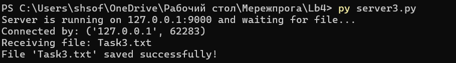
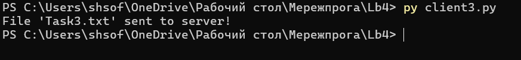

# Звіт з лабораторної роботи №4 Використання Socket API для мережевих додатків 

# студентки гр. КУІБ-22-1 Шматко Софії 

# Завдання

Створити клієнт та сервер з використанням Socket API згідно із завданнями: 

1. [easy] Розробити echo-сервер з використанням python socket API, який приймає з'єднання від клієнта та повертає клієнту отримані дані. Приклад реалізації сервера - https://docs.python.org/3/library/socket.html#example

   Програмний код для виконання завдання:**[server.py](Server.py)**

   Програмний код для виконання завдання: **[client.py](Client.py)**

   Результат виконання:

  
   
a.	[easy] Розробити echo-клієнт з використанням python socket API, який встановлює з'єднання з сервером, надсилає строкові дані та отримує відповідь. Приклад реалізації клієнта - https://docs.python.org/3/library/socket.html#example

   Результат виконання:

  
  
  2. [medium] Модифікувати TCP-сервер з п.1, щоб він працював постійно та обробляв запити від багатьох клієнтів послідовно. Для тестування сервера. запустити декілька разів клієнт з пункту 1-а. 

   Програмний код для виконання завдання:**[server2.py](Server2.py)**

   Результат виконання:

  

  
  
3 [medium/hard]  Розробити TCP-сервер з використанням python socket API, який приймає текстовий файл від клієнта та зберігає його локально на стороні сервера.

 Програмний код для виконання завдання:**[server3.py](Server3.py)**

 Програмний код для виконання завдання:**[client3.py](Client3.py)**

   Результат виконання:

  

  a.	[medium/hard]  Розробити TCP-клієнт, який відправляє будь-який текстовый файл на сервер. 

  Результат виконання:
  
   Зразок файлу:**[Task3.txt](Task3.txt)**

  

  

