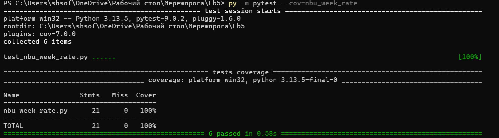
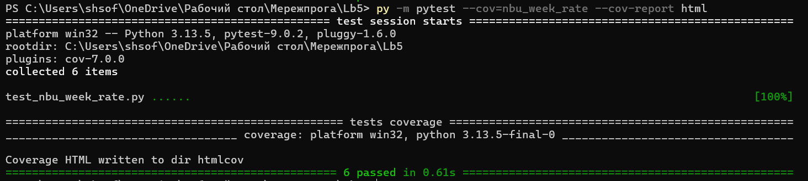
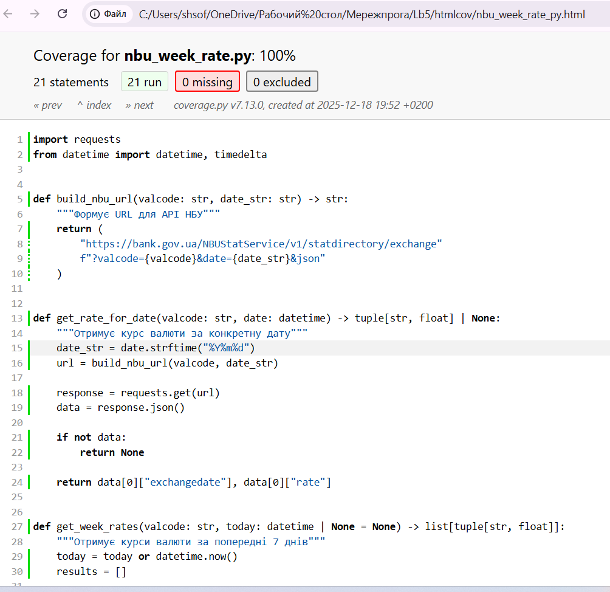

# Звіт з лабораторної роботи №5 Unit-тестування програм 

# студентки гр. КУІБ-22-1 Шматко Софії 

# Завдання

Встановіть необхідні залежності для написання unit-тестів:
pip install pytest pytest-cov
Використовуючи одне з завдань з ПЗ (ООП) написати unit-тести згідно наступних вимог:
Файл з unit-тестами повинен мати назву test_<назва програми>.py
Програма, що покривається тестами повинна мати не менше 3 функцій/методів
Кожна функція/метод повинна мати не менше 2 тестів
Покриття тестами повинно бути не менше 85%. Для перевірки покриття тестами використовуйте наступну команду:
pytest --cov=<назва програми> 

   Було встановлено необхідні залежності для написання unit-тестів у Python шляхом виконання команди pip install pytest pytest-cov. Далі, на основі одного з попередніх завдань з ПЗ (ООП) було підготовлено модуль програми, що містить щонайменше три функції/методи, які підлягають тестуванню. Для перевірки коректності роботи програми створено файл з unit-тестами з назвою у форматі test_nbu_week_rate.py. Для кожної функції/методу реалізовано не менше двох тестів, що дозволяє перевірити як коректні сценарії роботи, так і можливі граничні/помилкові випадки. Після написання тестів виконано запуск pytest та перевірено покриття за допомогою pytest-cov, що підтвердило працездатність тестового набору та відповідність вимогам завдання.

   Програмний код для тестування:**[nbu_week_rate.py](nbu_week_rate.py)**

   Файл з unit-тестами: **[test_nbu_week_rate.py](test_nbu_week_rate.py)**

   Після реалізації unit-тестів було перевірено рівень покриття коду тестами. Для цього використано інструмент pytest-cov та виконано команду
pytest --cov=nbu_week_rate.

   Результат виконання unit-тестів:

  
   
   Було сформовано html-звіт про покриття програми тестами
   pytest --cov==nbu_week_rate --cov-report html

   Результат виконання команди:

  
  

   Сформований html-звіт:

  

 
  

