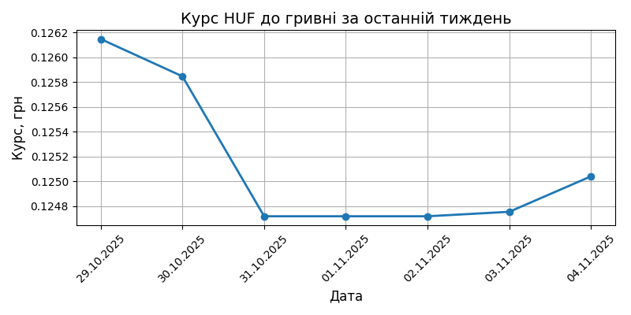
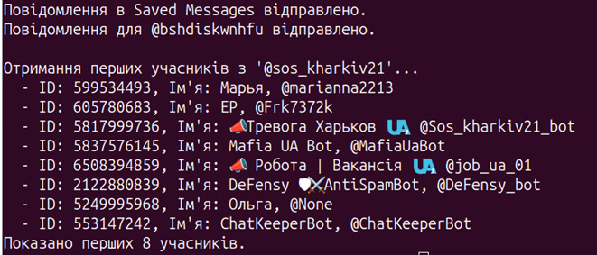
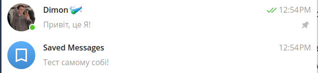
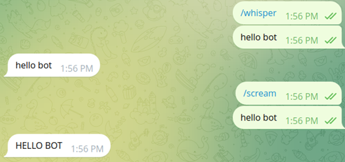

# Звіт з лабораторної роботи №1 студентки гр. КУІБ-22-1 Шматко С.О.

# Завдання
1. Отримати курс валют із сайту НБУ за попередній тиждень за допомогою Postman. Приклад використання API
    

2. Отримати курс валют із сайту НБУ за попередній тиждень з використанням python-бібліотеки requests
Програмний код для виконання завдання: **[Task2.py](Scripts/Task2.py)**

  
  
3 Побудувати графік зміни курсів валют за допомогою бібліотеки matplotlib
Програмний код для виконання завдання: **[Task3.py](Scripts/Task3.py)**

4. За допомогою python та бібліотеки telethon (https://docs.telethon.dev/en/stable/index.html) виконати наступні дії з Telegram: Програмний код для виконання завдання: **[Task4.py](Scripts/Task4.py)**
 - отримати перелік користувачів будь-якого чата/пабліку
   

- відправити повідомлення якомусь контакту напряму або опублікувати повідомлення в чат/паблік
  

6. На основі Telegram Bot API та прикладу (https://gitlab.com/Athamaxy/telegram-bot-tutorial/-/blob/main/TutorialBot.py) створити бота, що підтримує команди menu, whisper, scream
Програмний код для виконання завдання: **[Task5.py](Scripts/Task5.py)**

